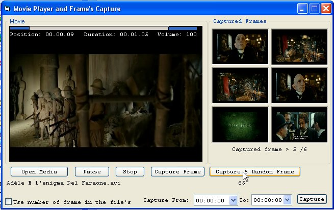



## How to Capture the \{FRAMES\} of all supported Media files \[Movie Media\]

### Description

UPDATE ON 02-22-2011 -> How to Capture the {FRAMES} of all supported Media files [Movie Media]...

The Author of the original code of the Media Player OCX is: Jason Lusk (EvilTeddyBear)

Found it at this link: http://www.planet-source-code.com/vb/scripts/ShowCode.asp txtCodeId=48129&lngWId=1 ! I used the dll freeware CapStill.dll to capture frames. You found the DLL at this link: http://www.gdcl.co.uk/index.htm. Supported and Captured movie format: *.avi;*.asf;*.mpg;*.mpeg;*.wmv;*.divx;*.dat;*.mpx;*mkv;*.mov;*.vob;*.flv

Don't forget to register the DLL CapStill.dll and adding a reference to this library before running the project! Also adding the reference 'Microsoft Active Movie Control Library'...

NEW UPDATE:

Capture Random 6 Frame's.

Convert captured BMP image to JPG compatible image file.

FEAUTURE's:

Capture from xx:xx:xx time to xx:xx:xx time

Enjoy
 
### More Info
 

             |
---                |---
**Submitted On**   |2009-10-08 11:45:38
**By**             |[Salvo Cortesiano \(Italy\)](https://github.com/Planet-Source-Code/PSCIndex/blob/master/ByAuthor/salvo-cortesiano-italy.md)
**Level**          |Advanced
**User Rating**    |4.9 (34 globes from 7 users)
**Compatibility**  |VB 6\.0
**Category**       |[DirectX](https://github.com/Planet-Source-Code/PSCIndex/blob/master/ByCategory/directx__1-44.md)
**World**          |[Visual Basic](https://github.com/Planet-Source-Code/PSCIndex/blob/master/ByWorld/visual-basic.md)
**Archive File**   |[How\_to\_Cap2198512222011\.zip](https://github.com/Planet-Source-Code/salvo-cortesiano-italy-how-to-capture-the-frames-of-all-supported-media-files-movie-media__1-72540/archive/master.zip)

